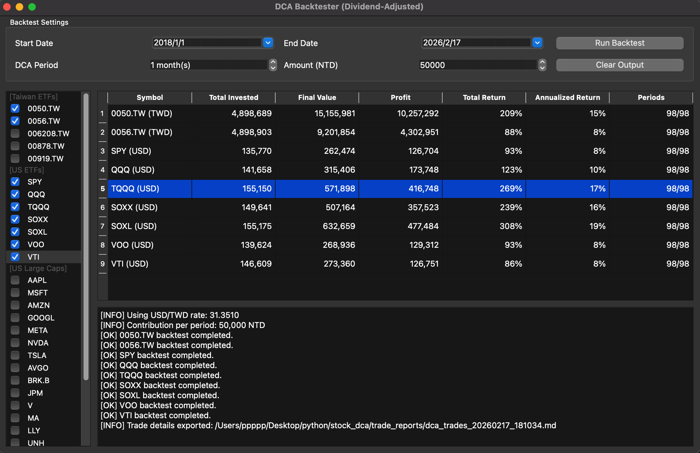

# DCA Backtester (PySide6)

A desktop DCA (Dollar-Cost Averaging) backtesting app built with Python and PySide6.



## What It Does

- Backtests periodic investing with dividend-adjusted historical prices (`Adj Close` from Yahoo Finance).
- Supports 0.1-share minimum buying for stocks and fractional units for crypto.
- Lets you backtest multiple symbols in one run.
- Exports detailed trade logs as Markdown after each run.
- Supports BTC/ETH DCA via `ccxt` (daily OHLCV from crypto exchanges).

## Symbol Groups

- Taiwan ETFs
- US ETFs
- US Large Caps
- Crypto (`BTC/USDT`, `ETH/USDT`)

Notes:
- `BRK.B` is shown in the UI, but automatically mapped to Yahoo Finance ticker `BRK-B` when downloading data.

## Inputs

- `Start Date`
- `End Date`
- `DCA Period (Days)` (every N day(s), default: 30)
- `Amount (NTD)` (integer display)

## Backtest Logic

1. Build a planned DCA schedule from start to end date.
2. Align each planned date to the next available trading day.
3. For Taiwan symbols (`.TW`): use the NTD amount directly.
4. For US symbols: convert NTD amount to USD using current `USD/TWD` rate (`TWD=X`).
5. Stocks: buy in 0.1-share increments. Crypto: buy fractional coin amounts.
6. Trading fee is fixed at `0.1%` per buy for both stocks and crypto.
7. If a period cannot buy at least 1 share, that period is skipped.
8. Final metrics are calculated from accumulated shares and the last available adjusted close.

Crypto notes:
- Default pair list: `BTC/USDT`, `ETH/USDT`
- Data source: `ccxt` daily candles (tries Binance first, then USD-pair fallbacks)

## Result Table

Columns:
- `Symbol` (includes currency tag, e.g. `SPY (USD)`, `0050.TW (TWD)`)
- `Total Invested`
- `Final Value`
- `Profit`
- `Total Return`
- `Annualized Return`
- `Periods` (`executed/planned`)

## Trade Report Output

After each successful run, the app writes a Markdown report to:

- `trade_reports/`

Filename format:

- `dca_trades_YYYYMMDD_HHMMSS.md`

Report includes:
- run settings
- FX rate used
- trading fee rate used
- per-symbol summary
- per-trade details (`planned date`, `trade date`, `price`, `units`, `spent`, `fee`)

## UI Actions

- `Run Backtest`: runs backtest for all selected symbols.
- `Clear Output`: clears both the result table and log panel.

## Requirements

- Python 3.10+
- Internet connection (Yahoo Finance data + FX rate)
- Internet connection (Yahoo Finance + crypto exchange API via `ccxt`)

## Installation

```bash
pip install -r requirements.txt
```

## Run

```bash
python main.py
```

## Project Files

- `main.py`: GUI + backtest engine
- `requirements.txt`: dependencies
- `.gitignore`: excludes `__pycache__/` and `trade_reports/`
